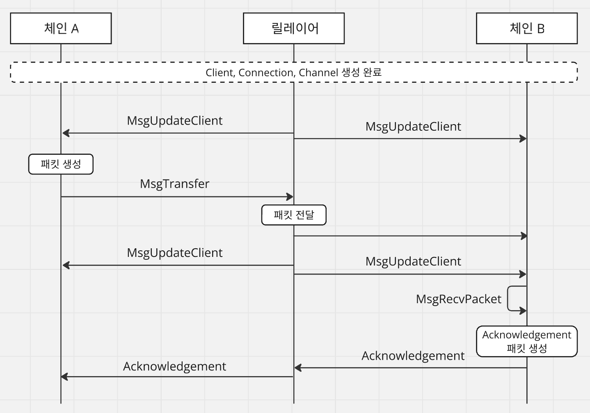
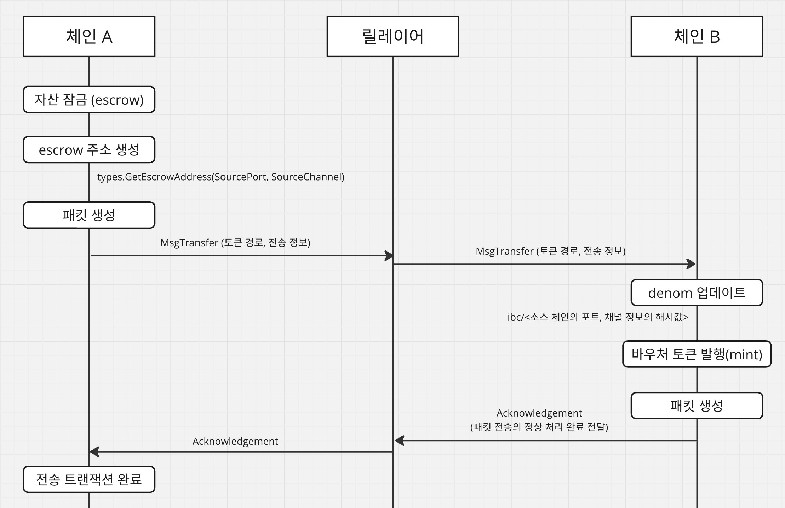

# IBC 토큰 전송 절차 분석 - Deep Dive

IBC에서 토큰을 전송할 때의 절차를 트랜잭션과 메시지를 중심으로 하여 코드레벨을 참고하여 분석한다.

<br>

## 트랜잭션 라이프사이클

[Cosmos-SDK v0.5.0](https://docs.cosmos.network/v0.50/learn/beginner/tx-lifecycle)을 기준으로 분석하였으며, 다음과 같은 단계가 존재한다.

1. 트랜잭션 생성 : CLI 또는 API를 통해 생성 후 서명
2. Mempool 추가 : CheckTx 검증을 통과한 트랜잭션은 Mempool에 저장
3. 블록 포함 : 합의를 통해 트랜잭션이 블록에 포함
4. 트랜잭션 실행 : DeliverTx를 통한 상태 변경 발생
5. 블록 커밋 : 트랜잭션과 상태 변화가 최종적으로 블록체인에 반영 %%

##### 1. 트랜잭션 생성 및 서명

사용자는 [CLI](https://docs.cosmos.network/v0.50/learn/advanced/cli) 또는 [REST/gRPC](https://docs.cosmos.network/v0.50/learn/advanced/grpc_rest) 인터페이스를 통해 트랜잭션을 생성할 수 있는데, 생성된 트랜잭션은 해당 사용자의 개인 키로 서명되고 네트워크에 broadcast된다. 

##### 2. Mempool 추가

각 노드는 전달받은 CheckTx 메시지를 통해 전달받은 트랜잭션의 유효성을 검증한다. 검증을 통과한 트랜잭션은 메모리풀(Mempool)에 저장되는데, 메모리풀은 각 노드가 검증되지 않은 트랜잭션을 임시로 저장하는 메모리 기반 공간을 의미한다. 

검증 과정은 크게 2가지로 구분되며, Stateless 이후 Stateful 순서로 진행된다.
  
- Stateless : 상태에 접근하지 않고 실행되며, 서명, 주소 형식 등을 검사한다.
- Stateful : 노드가 블록체인의 상태를 조회하여 트랜잭션의 자산 보유 여부와 같은 정보들을 확인한다.

##### 3. 트랜잭션의 블록 포함

제안자(proposer)는 합의 알고리즘(cometBFT 등)을 통해 새로운 블록을 제안한다. 블록에 포함된 트랜잭션들은 네트워크 내 다른 검증자들의 투표를 거쳐 블록에 추가될지 여부가 결정된다. 

##### 4. 트랜잭션 실행

트랜잭션이 포함된 블록이 검증되면, DeliverTx 함수를 통해 트랜잭션이 실제로 실행된다. 이 과정에서 트랜잭션의 상태 변화가 블록체인의 상태 변화에 반영된다. 

트랜잭션 실행 과정은 아래와 같다.
1. 트랜잭션 디코딩 : 노드는 []byte 형태의 트랜잭션을 unmarshaling 한다.
2. AnteHandler를 통한 추가 검증 : 서명 확인, 가스 사용량 계산 등 추가적인 검증을 수행한다.
3. 트랜잭션 실행 및 상태 변경
4. 실행된 트랜잭션에 대한 이벤트 기록
  
##### 5. 블록 커밋

검증자의 투표 결과의 합이 전체 2/3 이상의 가중치를 보유하고 있는 경우, 새로운 블록은 커밋된다.  노드의 블록체인 상태가 변경되고, 새롭게 생성된 머클루트 값이 블록체인에 기록된다. DeliverState를 어플리케이션 내부에 기록하여 상태 변경 결과를 모두 동기화한 후, 해당 값을 초기화하여 커밋을 마무리한다. 트랜잭션은 []byte 형태로 블록에 저장되어 블록체인에 추가된다.

<br>

## 토큰 전송 시 트랜잭션 처리 및 검증 과정

IBC에서 체인간 토큰을 전송할 때 MsgUpdateClient, MsgTransfer 메시지가 사용되는 경우와 이를 통해 진행되는 과정들을 코드 레벨을 통해 분석하고 정리한다.

클라이언트, 커넥션, 채널이 모두 정상적으로 생성되었다고 가정할 때, 서로 다른 두 체인 간 토큰 전송 시 사용되는 메시지의 흐름도를 간략하게 표현하면 아래와 같다.



### MsgUpdateClient

MsgUpdateClient는 IBC 클라이언트를 최신 상태로 업데이트 하기 위해 사용된다. 올바른 블록 헤더 및 상태 검증을 위해서 트랜잭션 전송 전과 트랜잭션 수신 이후 모두 호출된다.

```go
type MsgUpdateClient struct {
	// 클라이언트에 대한 고유 식별자 (ID)
	ClientId string 
	// 클라이언트 업데이트에 대한 매시지
	ClientMessage *types.Any 
	// 트랜잭션 서명자 주소
	Signer string 
}
```

ClientMessage의 경우 types.Any 타입으로 되어있는데, 이는 다양한 유형의 데이터를 포함할 수 있는 구조체를 의미한다. 그러므로 해당 데이터 내부에는 블록의 헤더와 같은 해당 체인의 상태를 포함하여 검증자가 서명한 데이터 등이 모두 포함 가능하다. 해당 메시지는 IBC 모듈 내에서 언패킹되어 아래와 같은 [ClientMessage](https://github.com/cosmos/ibc-go/blob/main/modules/core/exported/client.go#L151) 구조로 클라이언트 내 UpdateClient 함수에서 상태 업데이트에 사용된다.

```go
type ClientMessage interface {
	proto.Message

	ClientType() string

    // 기존에는 ValidateBasic을 통해 클라이언트 내부에서 Stateless 검증을 진행했지만
    // 현재는 msgServer가 모든 유효성 검사를 진행하며 해당 기능은 deprecated 되어있음
	ValidateBasic() error
}
```

릴레이어로부터 MsgUpdateClient 요청을 받은 IBC 모듈은 [UpdateClient](https://github.com/cosmos/ibc-go/blob/main/modules/core/keeper/msg_server.go)를 호출한다.

```go
// modules/core/keeper/msg_server.go
func (k *Keeper) UpdateClient(goCtx context.Context, msg *clienttypes.MsgUpdateClient) (*clienttypes.MsgUpdateClientResponse, error) {
    // gRPC로 전달된 컨텍스트를 SDK 기반의 컨텍스트로 변경
	ctx := sdk.UnwrapSDKContext(goCtx)

    // MsgUpdateClient 내부에 있는 ClientMessage를 언패킹하여 클라이언트 메시지를 반환. 오류 발생시 종료
	clientMsg, err := clienttypes.UnpackClientMessage(msg.ClientMessage)

    // 클라이언트 ID를 기반으로 언패킹된 클라이언트 메시지를 사용하여 클라이언트 상태 업데이트. 오류 발생시 종료
    // 아래에 있는 modules/core/02-client/keeper/client.go에 있는 UpdateClient 호출
	if err = k.ClientKeeper.UpdateClient(ctx, msg.ClientId, clientMsg); err != nil {...}

    // 업데이트 성공시 빈 값이 포함된 MsgUpdateClientResponse 반환
	return &clienttypes.MsgUpdateClientResponse{}, nil
}

...

// modules/core/02-client/keeper/client.go
func (k *Keeper) UpdateClient(ctx sdk.Context, clientID string, clientMsg exported.ClientMessage) error {
    // 클라이언트 ID에 해당하는 클라이언트 모듈 반환. 에러 발생 시 종료
	clientModule, err := k.Route(ctx, clientID)
	
	// 클라이언트가 현재 활성화 상태인지 확인. 비활성화 상태인 경우 종료
	if status := clientModule.Status(ctx, clientID); status != exported.Active {...}

	// 클라이언트 메시지 검증. 검증에 실패할 경우 종료
	if err := clientModule.VerifyClientMessage(ctx, clientID, clientMsg); err != nil {...}

	// 클라이언트의 비정상적인 동작이 있었는지 확인
    // 비정상적인 동작이 확인될 경우, 상태를 업데이트 하고 클라이언트를 비활성화 시킨 후 해당 내용에 대한 이벤트 발생 후 종료
	foundMisbehaviour := clientModule.CheckForMisbehaviour(ctx, clientID, clientMsg)
    ...

	// 클라이언트 상태 업데이트
	consensusHeights := clientModule.UpdateState(ctx, clientID, clientMsg)
    ...

	// 클라이언트 업데이트 이벤트 발생
	emitUpdateClientEvent(ctx, clientID, clientType, consensusHeights, k.cdc, clientMsg)
	return nil
}
```

### MsgTransfer

MsgTrasfer는 [ICS-20으로 정의된 토큰](https://github.com/cosmos/ibc/tree/master/spec/app/ics-020-fungible-token-transfer#data-structures)을 전송하기 위한 메시지로, 아래와 같이 구성되어 있다.

```go
type MsgTransfer struct {
	// 패킷이 전송될 포트 (송신 포트 ID)
	SourcePort string
	// 패킷이 전송될 채널 (송신 채널 ID)
	SourceChannel string
	// 소스 체인의 송신자 주소
	Sender string 
	// 싱크 체인의 수신자 주소
	Receiver string
    // 트랜잭션이 커밋될 수 있는 최대 블록 생성 대기 시간으로, 유예 가능한 블록 높이로 지정
	TimeoutHeight types1.Height 
    // 타임아웃에 대한 타임스탬프
	TimeoutTimestamp uint64 
    // 전송하려는 토큰 
	Tokens []types.Coin 
    ...
}
```

ibc-go애서 [TestMsgTransfer](https://github.com/cosmos/ibc-go/blob/main/modules/apps/transfer/keeper/msg_server_test.go)와 [TestHandleMsgTransfer](https://github.com/cosmos/ibc-go/blob/main/modules/apps/transfer/transfer_test.go)에 작성된 테스트 내용을 기반으로 MsgTransfer의 동작 로직을 확인하면 아래와 같다.




체인 간 자산 이동을 담당하는 객체로 [TransferKeeper와 BankKeeper](https://github.com/cosmos/ibc-go/blob/main/modules/apps/transfer/keeper/msg_server_test.go)가 있다. 해당 내용에 대해 chatGPT를 활용하여 정리한 내용은 아래와 같다.

#### TransferKeeper

- IBC 프로토콜을 기반으로 MsgTransfer를 통해 서로 다른 체인 간 자산을 전송한다. 이 때 전송되는 자산은 ICS-20 표준을 준수한다.
- 체인 간 전송된 자산을 escrow(잠금) 또는 소각(burn)한 후, 해당 자산과 동일한 가치를 지니는 바우처 토큰을 상대 체인에서 발행(mint)한다.
- 자산 전송에 해당하는 IBC 패킷을 생성하고, 해당 패킷에 대한 머클 증명을 통해 안전한 자산 전송이 가능함을 보장한다. 패킷은 릴레이어를 통해 소스 체인에서 싱크 체인으로 전달된다.

#### BankKeeper

- 단일 체인 내에서 자산을 전송한다. 
- 단일 체인 내에서 토큰의 발행(mint) 및 소각(burn)을 진행한다. 
- 각 계정의 잔액(balance)을 관리하고, 토큰 전송시 변경되는 송신자와 수신자 각각의 잔액을 업데이트한다.
- 체인 내에서 동작하는 내부 트랜잭션을 처리한다.

Cosmos SDK에서는 [x/bank 모듈](https://docs.cosmos.network/main/build/modules/bank)을 통해 블록체인 내에서의 자산을 관리하고 코인을 전송한다. 주요 기능을 요약하면 아래와 같다.
- 코인의 발행 및 소각을 통해 전체 공급량을 관리하고, 변경 사항을 추적한다.
- 모듈(auth.Account) 단위로 자산을 보유하거나 타 계정과 상호작용할 수 있고, 이를 통해 자산 처리 효율성을 높일 수 있다.
- 코인의 민팅, 소각, 스테이킹에 대한 권한을 설정하여 모듈별로 필요한 기능만 수행하도록 제어한다.
- 계정 별 잔액을 추적 및 관리하고, 토큰의 전체 수량 및 종류 또한 관리한다.
- 토큰의 메타데이터(정보), 속성 등을 기록하고 유지한다.
